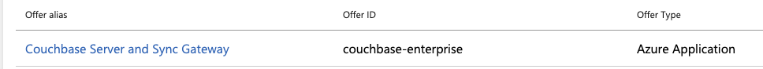
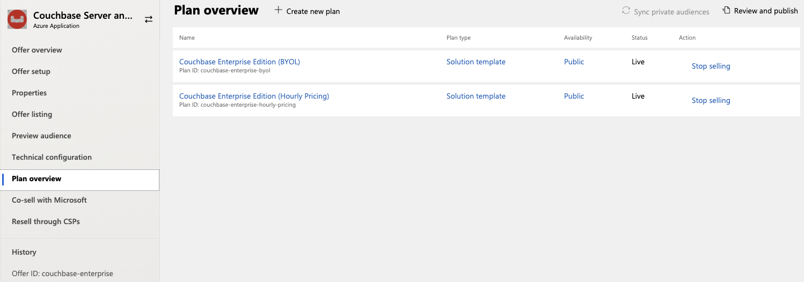
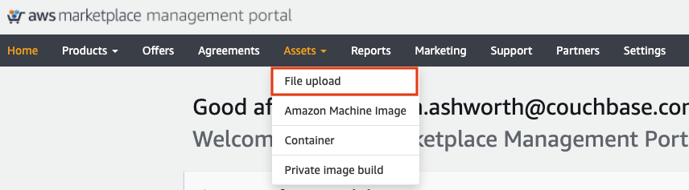
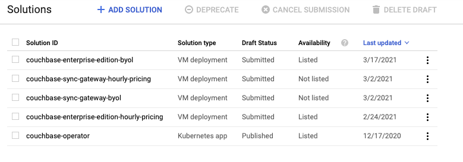
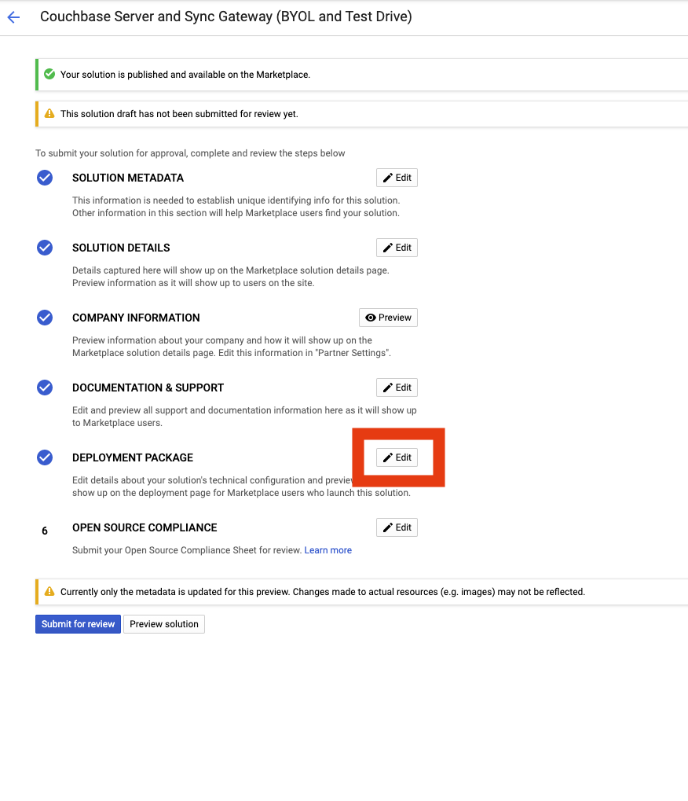
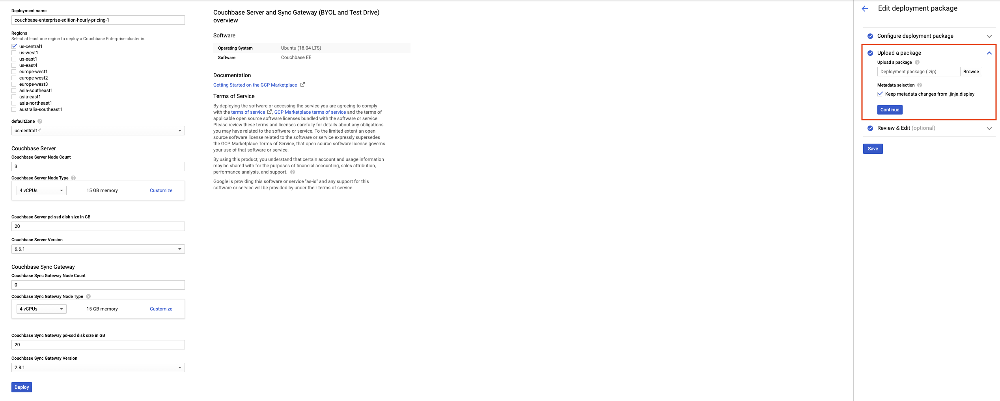
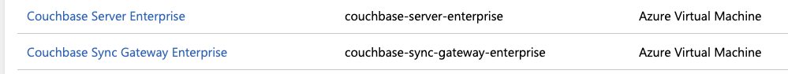
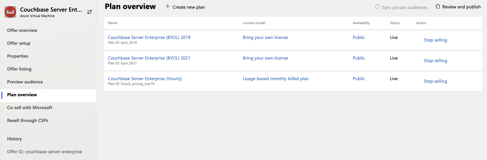
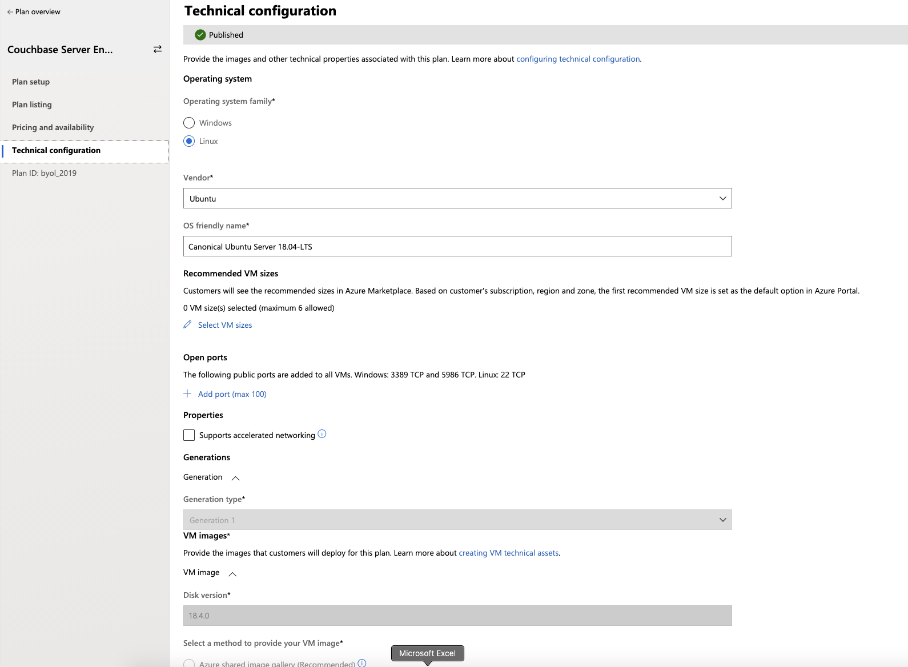

# Couchbase Public Marketplace Offerings

This repo contains the relevant templates (AWS Cloud Formation, Google Deployment Manager Scripts, and Azure ARM Templates) that represent the offerings.  Each marketplace is placed within 
its own folder (aws, azure, gcp).  Each offering exists within its own folder within the provider folder.

## Contributing

To contribute changes to the public marketplace offerings, fork this repo on Github, make your changes and create a pull request back to the couchbase-partners/marketplace repo.  
If you are referencing a JIRA ticket, please make sure that the JIRA number is in the commit history.

### Rebasing

Please rebase your PR to a single commit.

# Releases

Github actions have been created to manage the packaging of the scripts/templates necessary for updates to the marketplace offerings.  
Simply create a release via the github UI with the following syntax:  

`vN.Y.Z-(all|azure|gcp|aws|azure-vm)`

As an example, creating a release of `v1.0.0-azure` will bundle all necessary items for all azure offerings into a zip file, then add that zip file to the artifacts of the release. 
`-all` suffix will cause all providers to build their releases.  NOTE - This will not build the azure-vm, you must create a release specifically for it, as there is a cost associated
with it on Azure.

### **Azure Releases**

This repo manages the CouchbaseServerAndSyncGateway Azure Application offering.  When the azure release is created, it will add two zip files to the artifacts:  `azure-cbs-archive-byol.zip` 
and `azure-cbs-archive-hourly.zip`.  To upload the zip archives, navigate to the Azure Partner Center's Offer Listing 

Then plan overview. 

For azure, there is one offer with multiple plans (byol or hourly).  
Each of these zip files correllates to the respective plan's technical configuration. 

### **AWS Releases**

When a AWS release is created, 4 Cloud Formation templates are added to the release's artifacts:  `aws-cbs-byol.template`, `aws-cbs-hourly-pricing.template`, `aws-sg-byol.template`,
`aws-sg-hourly-pricing.template`.

To update the public offering, you must take the "Product Load Form" named `CouchbaseServerAndSyncGateway.xlsx` in the root of the `./aws/CouchbaseServerAndSyncGateway/` folder.  

In this product load form you will update any relevant fields, and upload it using the AWS Marketplace Partner Center Asset Upload Tool.  To get to the Asset Upload tool, go to the [Marketplace Management Portal](https://aws.amazon.com/marketplace/management/homepage?pageType=awsmpmp%3Acustomer) and select "File Upload".

Once you have uploaded it, you must create a support ticket through the [contact us](https://aws.amazon.com/marketplace/management/contact-us/?#) 
link informing them of the update and specifying that you have update to the marketplace templates.  You will need to send those templates to AWS via however the respondant to the support ticket requests.

Currently, the sync gateway templates (sg) are only utilized for private offers and are not part of the public offering.

### **GCP Releases**

When a GCP release is created there are 4 different archives created and added to the release's artifacts:  `gcp-cbs-archive-byol.zip`, `gcp-cbs-archive-hourly-pricing.zip`, 
`gcp-sg-archive-byol.zip`, `gcp-sg-archive-hourly-pricing.zip`.

To update the GCP Solutions, go to Google Cloud Platform's Marketplace Partner Portal that can be found via the GCP Marketplace link from The Google Cloud Platform Console.

Inside the partner portal, you will find the listing of "Solutions" for the GCP Marketplace.

The four zip archives added to the release artifacts map to each of the solutions offered (minus the couchbase-operator, which is not present in this repository).

After opening a "Solution" and clicking "Edit", You will click on the "Edit" button next to "Deployment Package"

ALL INFORMATION IN THE UI FORMS ARE FOUND IN THE ARCHIVE via the couchbase.py.display!
If you make any changes to the UI, the archive will override it without checking the box to maintain meta-data.

### **VM Releases**

The way marketplaces track the usage of your offering is via the custom AMI, Virtual Machine Image, or Instance Template.  These are accessed via different methods.  
In Azure and GCP, these are accessed by an URL.  In AWS, these are accessed by the AMI ID.  All of these images are created in a similar manner.  You provision a virtual machine using a base
image, load any desired software, deprovision it so that it is only a disk image, then save it as a template.  All cloud providers provide APIs and CLI commands to perform these operations.

Periodically, updates should be made to these images to apply critical security updates and reduce provisioning time.

#### *AWS*

See [AWS Documentation](https://docs.aws.amazon.com/AWSEC2/latest/UserGuide/creating-an-ami-ebs.html) for steps in creating the AMI.  Once you have the AMI, you must update the product load form
with the new AMI id and submit it as an update.  Amazon will clone the AMI accross regions and provide you a mapping of AMI IDs to region and you must update the mapping.byol.json and mapping.
hourly.json with this map.  Once you have performed this update, you will then need to create an `-aws` update and submit a second update with the updated AMI ids.

### *Azure*

Azure VM creation has been automated using the `CouchbaseServerEnterprise-VirtualMachine/create.sh`.  Simply create a release with a suffix `-azure-vm` and a json file called
`TechnicalConfiguration.json` will be added to the release artifacts.  To update the VM, you will navigate to the Azure Partner Center's offer listing.  Then to the plan overview (Each offer can have multiple plans) 
Then inside each plan, you can update the technical configuration with the `TechnicalConfiguration.json` 

### *GCP*

See [GCP Documentation](https://cloud.google.com/compute/docs/images/create-delete-deprecate-private-images) for steps in creating a Custom Image.  Once a new image has been created, you must
update the `group.py` with the correct URI to the new images.

# Marketplace Scripts

The marketplace offerings all use an install script located at [Marketplace-Scripts](https://github.com/couchbase-partners/marketplace-scripts) for installation of Couchbase Server and Sync
Gateway.  There are multiple references to `__INSTALL_SCRIPT__` within the codebase.  During build, these are replaced with the content of the `script_url.txt` file using the 
`script_url_replacer.sh`